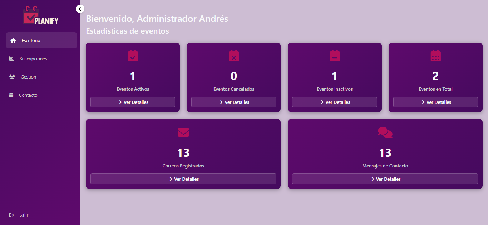

# PlaniFy

PlaniFy es una página web que promociona eventos de forma clara y atractiva. Cuenta con una one-page principal con un carrusel que muestra los eventos más relevantes, una sección con la información de cada evento, un área de contacto para que los usuarios envíen mensajes y un footer con la opción de suscribirse para recibir notificaciones cuando se creen nuevos eventos.

## Características

- One-page con carrusel de eventos
- Sección de detalles de eventos con información relevante
- Sección de contacto con formulario funcional
- Footer con suscripción para notificaciones de nuevos eventos
- Panel de administración con estadísticas de eventos, correos y mensajes

## Tecnologías utilizadas

- HTML
- CSS
- JavaScript
- Bootstrap
- Local Storage (gestión de correos y mensajes)

## Cómo usar

1. Clonar este repositorio:
git clone https://github.com/tuusuario/planify.git

2. Abrir el archivo `index.html` en el navegador.

No requiere instalación de dependencias ni servidores adicionales.

## Estado del proyecto

En desarrollo. Falta implementar el envío automático de correos cada vez que se crea un evento.

## Equipo

- Miguel Ángel Arias
- Juan Fernando Puerta
- Juan Camilo Álvarez
- Juan José Vargas

## Capturas

### Página principal

### Sección de contacto

### Panel de administración

## Contacto

Para sugerencias, mejoras o reportar errores, puedes contactar a Miguel Ángel Arias.
"""

# Guardar como README_Planify.txt
with open("/mnt/data/README_Planify.txt", "w", encoding="utf-8") as f:
 f.write(readme_content)

# Devolver el archivo para descarga directa
"/mnt/data/README_Planify.txt"